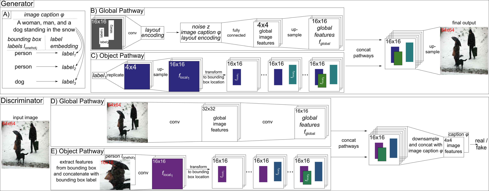
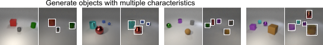
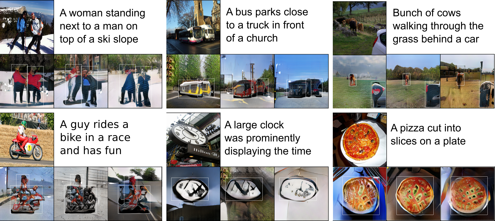
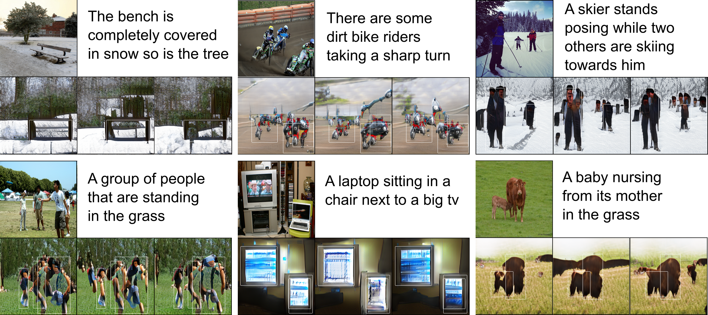

# Generating Multiple Objects at Spatially Distinct Locations
Pytorch implementation for reproducing the results from the paper [Generating Multiple Objects at Spatially Distinct Locations](https://openreview.net/forum?id=H1edIiA9KQ) by Tobias Hinz, Stefan Heinrich, and Stefan Wermter accepted for publication at the [International Conference on Learning Representations](https://iclr.cc/) 2019.

> *For more information and visualizations also see our [blog post](https://tohinz.github.io/blog/generating-multiple-objects-at-spatially-distinct-locations)*

> Our poster can be found [here](https://postersession.ai/)

Have a look at our follow-up work [Semantic Object Accuracy for Generative Text-to-Image Synthesis](https://arxiv.org/abs/1910.13321) with available [code](https://github.com/tohinz/semantic-object-accuracy-for-generative-text-to-image-synthesis).



# Dependencies
- python 2.7
- pytorch 0.4.1

Please add the project folder to PYTHONPATH and install the required dependencies:

```
pip install -r requirements.txt
```

# Data
- Multi-MNIST: adapted from [here](https://github.com/aakhundov/tf-attend-infer-repeat)
    - contains the three data sets used in the paper: normal (three digits per image), split_digits (0-4 in top half of image, 5-9 in bottom half), and bottom_half_empty (no digits in bottom half of the image)
    - [download](https://www2.informatik.uni-hamburg.de/wtm/software/multiple-objects-gan/data-multi-mnist.zip) our data, save it to `data/` and extract
- CLEVR: adapted from [here](https://github.com/facebookresearch/clevr-dataset-gen)
    - Main: [download](https://www2.informatik.uni-hamburg.de/wtm/software/multiple-objects-gan/data-clevr-main.zip) our data, save it to `data/` and extract
    - CoGenT: [download](https://www2.informatik.uni-hamburg.de/wtm/software/multiple-objects-gan/data-clevr-cogent.zip) our data, save it to `data/` and extract
- MS-COCO:
    - [download](https://www2.informatik.uni-hamburg.de/wtm/software/multiple-objects-gan/data-ms-coco.zip) our preprocessed data (bounding boxes and bounding box labels), save it to `data/` and extract
    - obtain the train and validation images from the 2014 split [here](http://cocodataset.org/#download), extract and save them in `data/MS-COCO/train/` and `data/MS-COCO/test/`
    - for the StackGAN architecture: obtain the preprocessed char-CNN-RNN text embeddings from [here](https://github.com/hanzhanggit/StackGAN-Pytorch) and put the files in `data/MS-COCO/train/` and `data/MS-COCO/test/`
    - for the AttnGAN architecture: obtain the preprocessed metadata and the pre-trained DAMSM model from [here](https://github.com/taoxugit/AttnGAN)
        - extract the preprocessed metadata, then add the files downloaded in the first step (bounding boxes and bounding box labels) to the `data/coco/coco/train/` and `data/coco/coco/test/` folder 
        - put the downloaded DAMSM model into `code/coco/attngan/DAMSMencoders/` and extract

# Training
- to start training run `sh train.sh data gpu-ids` where you choose the desired data set and architecture (mnist/clevr/coco-stackgan-1/coco-stackgan-2/coco-attngan) and which/how many gpus to train on
- e.g. to train on the Multi-MNIST data set on one GPU: `sh train.sh mnist 0`
- e.g. to train the AttnGAN architecture on the MS-COCO data set on three GPUs: `sh train.sh coco-attngan 0,1,2`
- training parameters can be adapted via `code/dataset/cfg/dataset_train.yml`
- make sure the DATA_DIR in the respective `code/dataset/cfg/dataset_train.yml` points to the correct path
- results are stored in `output/`

# Evaluating
- update the eval cfg file in `code/dataset/cfg/dataset_eval.yml` and adapt the path of `NET_G` to point to the model you want to use (default path is to the pretrained models linked below)
- run `sh sample.sh mnist/clevr/coco-stackgan-2/coco-attngan` to generate images using the specified model

# Pretrained Models
- pretrained model for Multi-MNIST: [download](https://www2.informatik.uni-hamburg.de/wtm/software/multiple-objects-gan/model-multi-mnist.zip), save to `models` and extract
- pretrained model for CLEVR: [download](https://www2.informatik.uni-hamburg.de/wtm/software/multiple-objects-gan/model-clevr.zip), save to `models` and extract
- pretrained model for MS-COCO:
    - StackGAN architecture: [download](https://www2.informatik.uni-hamburg.de/wtm/software/multiple-objects-gan/model-ms-coco-stackgan.zip), save to `models` and extract
    - AttnGAN architecture: [download](https://www2.informatik.uni-hamburg.de/wtm/software/multiple-objects-gan/model-ms-coco-attngan.zip), save to `models` and extract

# Examples Generated by the Pretrained Models
### Multi-MNIST


### CLEVR


### MS-COCO
##### StackGAN Architecture


##### AttnGAN Architecture


# Acknowledgement
- Code for the experiments on Multi-MNIST and CLEVR data sets is adapted from [StackGAN-Pytorch](https://github.com/hanzhanggit/StackGAN-Pytorch).
- Code for the experiments on MS-COCO with the StackGAN architecture is adapted from [StackGAN-Pytorch](https://github.com/hanzhanggit/StackGAN-Pytorch), while the code with the AttnGAN architecture is adapted from [AttnGAN](https://github.com/taoxugit/AttnGAN).

# Citing
If you find our model useful in your research please consider citing:

```
@inproceedings{hinz2019generating,
title     = {Generating Multiple Objects at Spatially Distinct Locations},
author    = {Tobias Hinz and Stefan Heinrich and Stefan Wermter},
booktitle = {International Conference on Learning Representations},
year      = {2019},
url       = {https://openreview.net/forum?id=H1edIiA9KQ},
}
```
