---
---

# Introduction
>  **[Richard Feynman](https://en.wikipedia.org/wiki/Richard_Feynman): What I cannot create, I do not understand.**

One of the goals of generative models in machine learning is to model (and sample from) complex, unknown data distributions. As such, generating (and therefore modeling) images has become a popular task for generative models. This is mostly due to increased computing power and novel models (such as [Generative Adversarial Nets](http://papers.nips.cc/paper/5423-generative-adversarial-nets) and [Variational Autoencoders](https://arxiv.org/abs/1312.6114)) that are "good" at modeling images. Additionally, we have a lot of images available to us (i.e. lots of training data) and images represent a reasonably complex data distribution[1](#myfootnote1).

Currently, [Generative Adversarial Nets](http://papers.nips.cc/paper/5423-generative-adversarial-nets) (GANs) are one of the models that tend to produce the sharpest images. A GAN typically consists of two neural networks (see Figure 1): a generator network which generates images and a discriminator network which tries to distinguish between real images and the images generated by the generator. The generator gets as input a randomly sampled noise vector (and possibly additional information about the image such as a textual description) and applies a number of transforms to generate an image from it. The discriminator gets as input either a "real" image from the data set we work with or an image that was generated by the generator (along with the additional information that was also given to the generator).

The discriminator's goal is to distinguish between real and generated images, while the generator's goal is to "fool" the discriminator, i.e. to generate images that are indistinguishable from real ones. This results in a competition between the two networks and both networks are typically trained in an alternating manner to get better at their respective goals. The end result (ideally) is a generator that can generate images that are indistinguishable from real images.

<figure>
    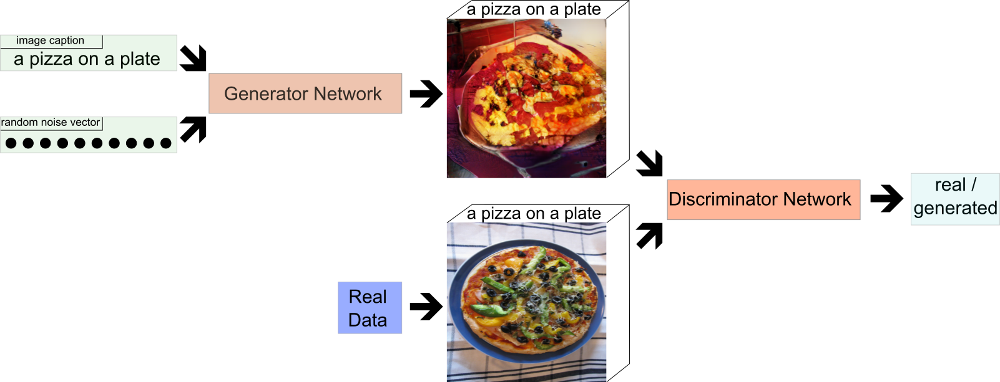
    <figcaption><i>Figure 1: Image of a GAN, depicting the generator and discriminator networks and the various inputs each network gets.</i></figcaption>
</figure>

However, most current GAN models focus on modeling images that either contain only one centralized object (e.g. faces ([CelebA](http://mmlab.ie.cuhk.edu.hk/projects/CelebA.html)), objects ([ImageNet](http://www.image-net.org/)), birds ([CUB-200](http://www.vision.caltech.edu/visipedia/CUB-200-2011.html)), flowers ([Oxford-102](http://www.robots.ox.ac.uk/~vgg/data/flowers/102/))) or on images from one specific domain (e.g. [LSUN](http://lsun.cs.princeton.edu/2017/) bedrooms or churches). This means that, overall, the variance between images used for training GANs tends to be low, while many real-life images tend to depict complex scenes with different objects at different locations.

<figure>
    
    <figcaption><i>Figure 2: Example Images from CelebA, ImageNet, CUB-200, and Oxford-102 data sets (left to right)</i></figcaption>
</figure>

The [MS-COCO](http://cocodataset.org/#home) data set (see Figure 3 for example images) consists of more than 100,000 images of "**C**ommon **O**bjects in **CO**ntext" and has a high variability in its image contents. Each image is associated with five captions that describe the image. In order to model images with complex scenes like in the MS-COCO data set, we need models that can model images containing multiple objects at distinct locations. To achieve this, we need control over what kind of objects are generated (e.g. persons, animals, objects), the location, and the size of these objects.

<figure>
    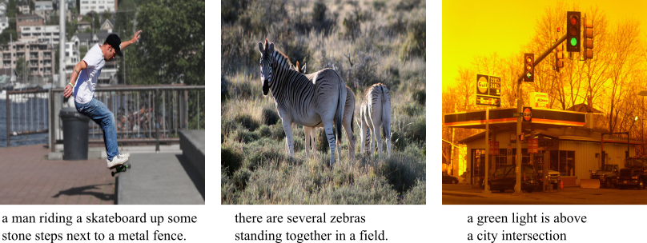
    <figcaption><i>Figure 3: Example Images from the MS-COCO data set.</i></figcaption>
</figure>
[Current](https://arxiv.org/abs/1804.01622) [work](https://arxiv.org/abs/1711.11585) [often](https://arxiv.org/abs/1612.00215) approaches this challenge by using a scene layout as additional conditional input to the model. A scene layout basically defines the structure of a given scene on a high-level, abstract basis and describes where in the image certain objects should be located. GANs that make use of these layouts therefore have more information about the image they should generate and we can control the image generation process by adapting the individual scene layouts. However, in order to train these models we need images with a known scene layout, which is usually obtained by having humans annotate images. As a result, many of the recent models are trained on the [COCO-Stuff](https://github.com/nightrome/cocostuff) data set (see Figure 4), which augments the MS-COCO data set with pixel-level annotations.

<figure>
    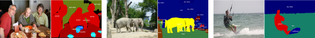
    <figcaption><i>Figure 4: Example images from the COCO-Stuff data set and their respective scene layout</i></figcaption>
</figure>

Our work takes a similar approach, but instead of needing a complete scene layout for each image during training we only require the location of "salient" objects within the image (see Figure 5), while the rest of the scene (e.g. the background) is generated automatically. This reduces the amount of labels we need for our training images. Additionally, it also makes it easier to modify the layout of an image, since all we have to do is move around the location of the objects whose location we want to change, while the model will keep the background and the relationships between the objects coherent without further instructions.

<figure>
    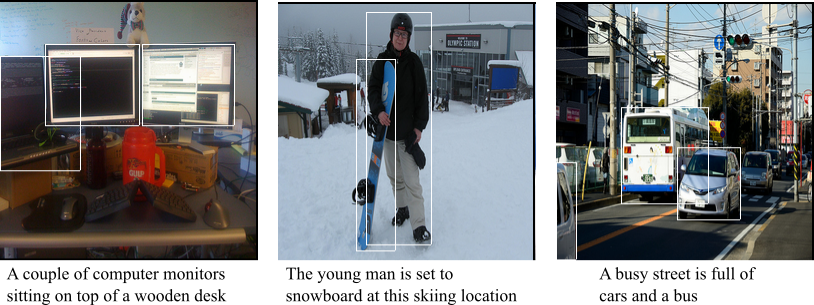
    <figcaption><i>Figure 5: Examples of MS-COCO imgages with the respecitve bounding boxes</i></figcaption>
</figure>

The MS-COCO data set already provides bounding boxes for many objects within the image, encompassing 80 different object categories such as persons, animals, and cars. We can use these bounding boxes and their respective object category to determine the location and identity of objects within images and use this for training our model.

# Methodology

Our model is a GAN as depicted in Figure 1 with some architectural adaptations (see Figure 6). We extend both our generator and our discriminator with an **object pathway** which is responsible for modeling the individual objects we encounter during training[2](#myfootnote2). The **global pathway**, on the other hand, takes care of the image background and ensures the overall image consistency. The figure below gives a high-level overview of our model.

<figure>
    
    <figcaption><i>Figure 6: Both the generator and the discriminator of our model consist of a global and an object pathway. The global pathway focuses on global image characteristics, such as the background, while the object pathway is responsible for modeling individual objects at their specified location.</i></figcaption>
</figure>

#### Generator

We first create a label for each salient object within the image. For this we use the [caption embedding](https://github.com/reedscot/icml2016) for this image (i.e. the image caption is represented as a vector) and concatenate it with the label (encoded as a one-hot vector) for the given object (e.g. "person"). From this we obtain a label embedding for the given object by applying a matrix multiplication and a non-linearity (i.e. a fully connected layer). By combining the image caption and the object label to generate the final label the network can incorporate additional information (such as shape or color, which is not obtainable from the object label itself) into the final label.

<figure>
    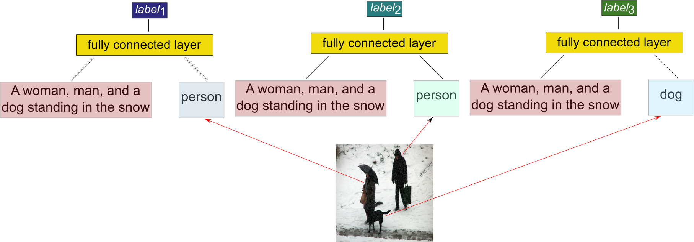
    <figcaption><i>Figure 7: Obtain individual labels for each bounding box.</i></figcaption>
</figure>

Once we have a label for each of the objects we want to model we continue with the global and object pathway. The **global pathway** first creates a layout encoding (Figure 8) which encodes the general scene layout, i.e. the location and object category of the different objects we want to model. To obtain the layout encoding we spatially replicate the previously obtained labels for each of the objects at the locations of their bounding box within an empty image. The resulting layout is then encoded with a convolutional neural network (CNN).

<figure>
    
    <figcaption><i>Figure 8: Obtain a layout encoding for the generator's global pathway.</i></figcaption>
</figure>

This layout encoding is then concatenated with the image caption embedding and the randomly sampled noise vector and we then apply multiple convolutional layers with intermediate nearest neighbor upsampling to obtain a representation of the global image background.

<figure>
    
    <figcaption><i>Figure 9: Global pathway of the generator.</i></figcaption>
</figure>

In parallel, the **object pathway** gets as input the first of the previously generated object label and uses it to generate a representation of this object. This object representation is then added to an empty image at the location of the object's bounding box (Figure 10). We repeat this for each of the object labels until we have an image that contains the object representations at the given bounding box locations.

<figure>
    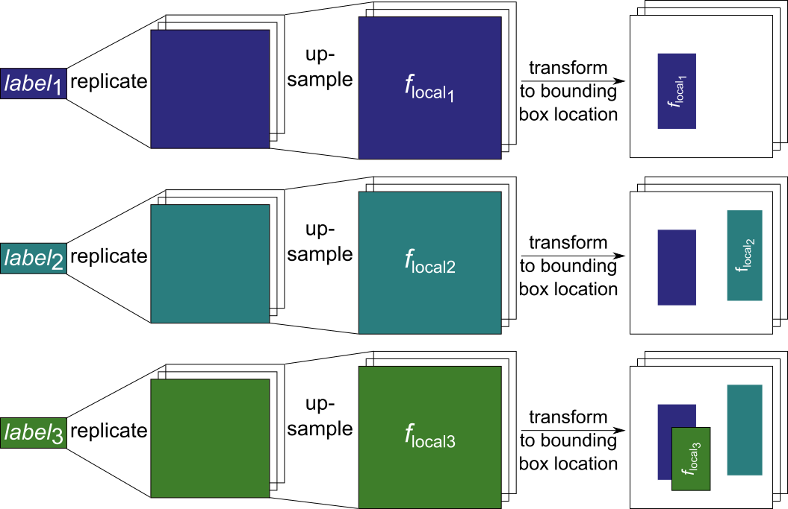
    <figcaption><i>Figure 10: Oject pathway of the generator.</i></figcaption>
</figure>

As a final step, we concatenate the output of the global and object pathways and apply more convolutional layers with intermediate nearest neighbor upsampling to obtain a the final image for the given image caption and bounding box locations.

<figure>
    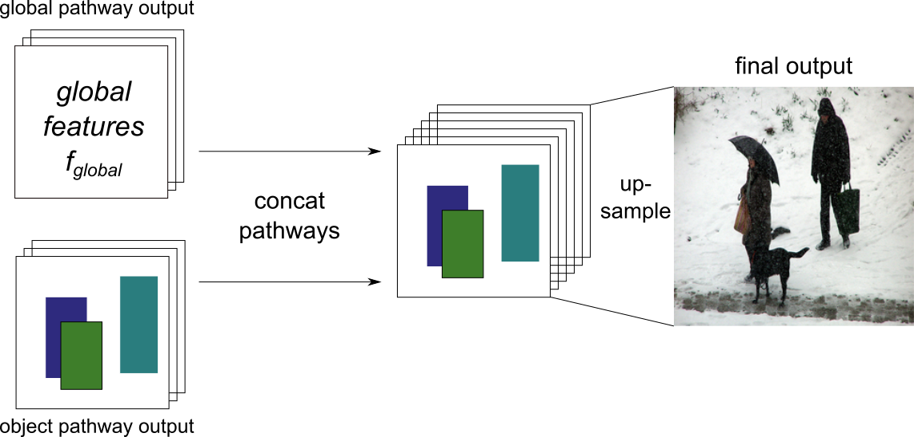
    <figcaption><i>Figure 11: Final output of the generator.</i></figcaption>
</figure>

#### Discriminator

The discriminator also consists of a **global** and an **object pathway**. 

The **global pathway** uses a CNN to obtain a global feature representation of the whole image. 

<figure>
    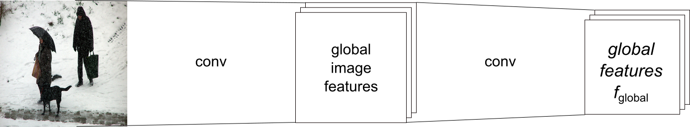
    <figcaption><i>Figure 12: Global pathway of the discriminator.</i></figcaption>
</figure>

The **object pathway** is again applied to each of the objects individually. We extract the first object from the image and concatenate it with the object category for this object (e.g. "person"). We then apply a CNN to obtain a feature representation of the given object, which is placed at the location of the bounding box on an empty image. This is done for each of the objects within the image and results in an image that contains the object features of the given objects at their given location.

<figure>
    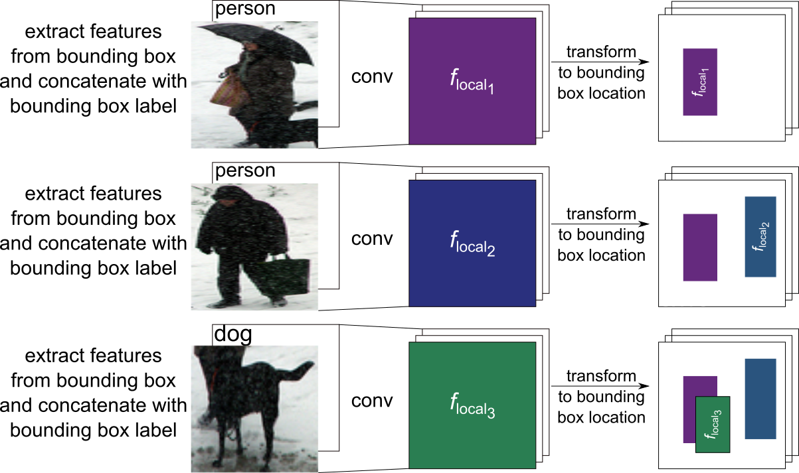
    <figcaption><i>Figure 13: Object pathway of the discriminator.</i></figcaption>
</figure>

Finally, the outputs of the object and global pathways are again concatenated and processed by a CNN. At the end, the features from the CNN are concatenated with the given image caption embedding and the resulting tensor is classified as either generated or real.

<figure>
    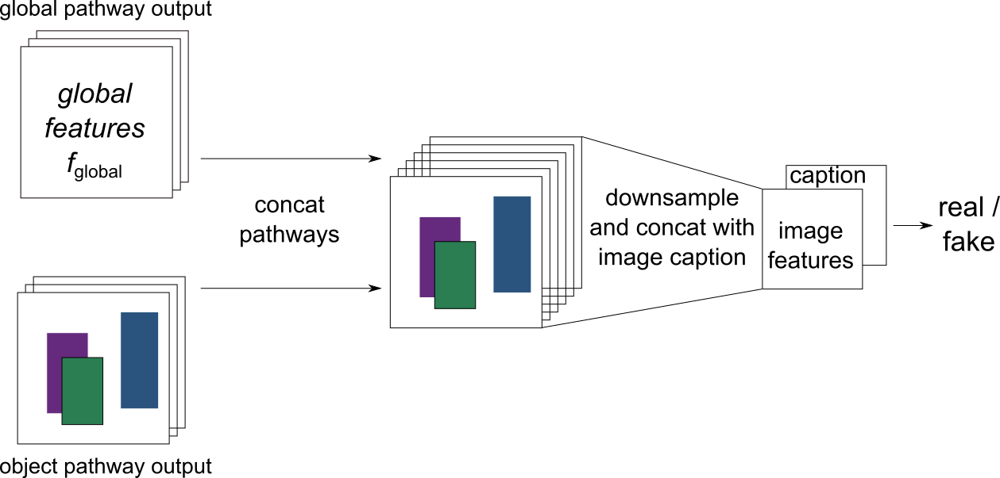
    <figcaption><i>Figure 14: Final output of the discriminator.</i></figcaption>
</figure>

#### Training

For the general training, we can utilize the same procedure that is used in the GAN architecture that
is modified with our proposed approach. As previously described, the generator is trained to generate images that fool the discriminator, while the discriminator is trained to distinguish between real and generated images. For more information about the training see the Approach section and the Appendix of our [paper](https://arxiv.org/abs/1901.00686), as well as the code in our [Github](https://github.com/tohinz/multiple-objects-gan).

# Evaluation

Evaluating generative models is a notoriously hard task for which it is difficult to find good quantitative metrics[3](#myfootnote3). We first trained our model on two synthetic data sets ([Multi-MNIST](https://github.com/aakhundov/tf-attend-infer-repeat) and [CLEVR](https://github.com/facebookresearch/clevr-dataset-gen)) and evaluate it qualitatively on different subsets of these data sets. Following this, we trained our model on the [MS-COCO](http://cocodataset.org/#home) data set and evaluate it qualitatively and quantitatively. For the quantitative evaluation we use the [Inception Score](http://papers.nips.cc/paper/6124-improved-techniques-for-training-gans) (IS) and the [Fréchet Inception Distance](https://arxiv.org/abs/1706.08500) (FID), as well as a novel evaluation metric based on how often a pre-trained object detector detects a given object in our generated images.

#### Multi-MNIST

On the Multi-MNIST data set we use training images that contain three digits at non-overlapping positions.

<figure>
    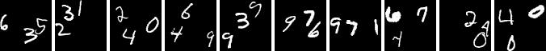
    <figcaption><i>Figure 15: Real samples from the our Multi-MNIST data set.</i></figcaption>
</figure>

After the training was finished we can use our model to generate new images in which we can specify where a digit should occur and what kind of digits should be generated. Even though our training images only consisted of images that contained exactly three digits our model is able to generate images with various amounts of digits:

<figure>
    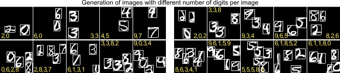
    <figcaption><i>Figure 16: Generated Multi-MNIST images with different numbers of digits per image (yellow digits are the ground truth labels given to the generator, bounding boxes highlighted for visualization).</i></figcaption>
</figure>

Furthermore, we can also change the size of the digits within the images:

<figure>
    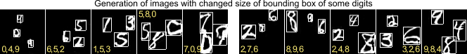
    <figcaption><i>Figure 17: Generated Multi-MNIST images where digits are different sizes.</i></figcaption>
</figure>

We also performed ablation studies in which we trained the model without some of the extensions, e.g. without the layout encoding in the generator's global pathway or without the object pathway in either the generator or the discriminator. We found that all of the extensions were necessary to achieve optimal performance and refer to our [paper](https://arxiv.org/abs/1901.00686) for more details.

#### CLEVR

The CLEVR data set consists of images which contain different objects (cylinders, cubes, and spheres) of different sizes, colors, and materials at different locations.

<figure>
    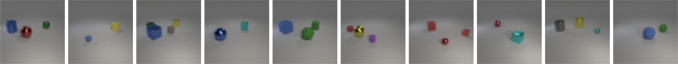
    <figcaption><i>Figure 18: Real samples from our CLEVR data set.</i></figcaption>
</figure>

We rendered images that contain 2-4 objects at various locations and again trained our model. After the training was finished we can generate images in which we can control different aspects (object category, color, location, and size) of the objects. As before, we can also generate images that contain more objects in an image than were observed during training.

<figure>
    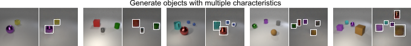
    <figcaption><i>Figure 19: Generated CLEVR images. The left image of each pair is rendered by the rendering software, the right image of each pair is the image generated by our model (bounding boxes highlighted for visualization).</i></figcaption>
</figure>

To test the generalization capabilities of our model we also used an adapted version of the CLEVR data set (CLEVR CoGenT) in which some color-object combinations only occur in either the training or the test set. Specifically, in the training set cubes are either gray, blue, brown, or yellow, while cylinders are either red, green, purple, or cyan. In the test set these combinations are inverted. Spheres can have either color in both the training and the test set. We can see that our model is able to generalize to novel object-color combinations, even though we can observe some minor artifacts.

<figure>
    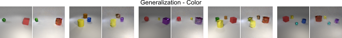
    <figcaption><i>Figure 20: Generated images from the CLEVR-CoGenT data set.</i></figcaption>
</figure>
Overall, the experiments on the synthetic data sets indicate that our model is able to control the location and various other characteristics of individual objects. It can also generalize to previously unseen object characteristics, unseen locations (if the location has been observed for another object during training) and to unseen numbers of objects. To further test the model's capabilities we now proceed with a more complex data set.

#### MS-COCO

To evaluate our model on real world images we trained it on the MS-COCO data set. For each image we take the three biggest objects (based on their bounding boxes) as long as they cover at least 2% of the total image each. As a result, our training data consists of images with their associated captions and 0-3 labeled objects for the object pathways. 

After the training was finished we evaluated the generated images qualitatively to check if objects are placed at the requested locations. We can see that the images indeed contain objects at the given locations.

<figure>
    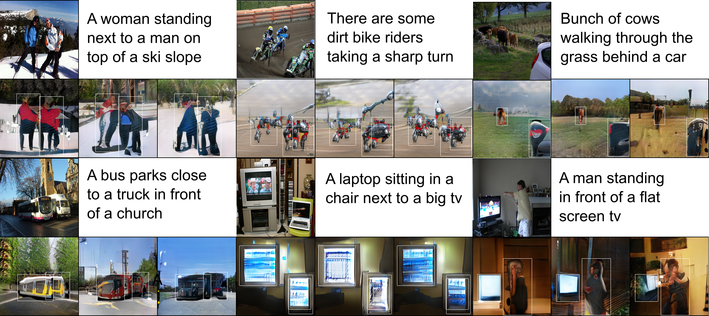
    <figcaption><i>Figure 21: Generated images from the MS-COCO data set. First and third rows show original images from the MS-COCO data set and their respective image captions. Rows two and four show the generated images. </i></figcaption>
</figure>

To evaluate the impact of the global and the object pathway we can generate images while switching either the global or the object pathway off. We can see that the global pathway does indeed focus on the background of the image, but mostly ignores the high level objects at the given location. These are modeled by the object pathway, as can be seen in the last row.

<figure>
    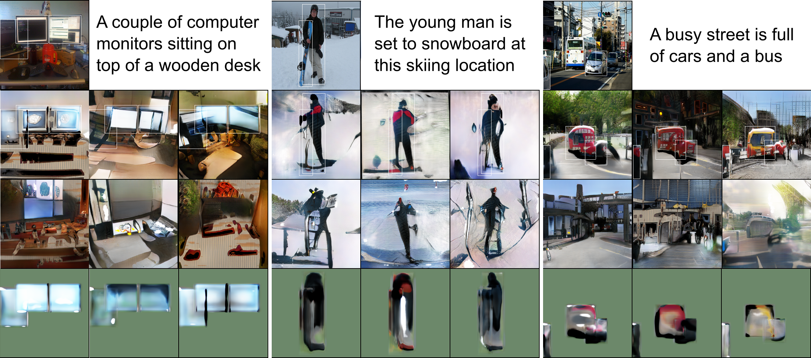
    <figcaption><i>Figure 22: Visualization of the object and global pathway. Row one shows the original MS-COCO images and corresponding captions. Row two shows images that were generated with all pathways enabled. Row three shows generated images when the object pathway was deactivated, while row four shows images with the global pathway deactivated.</i></figcaption>
</figure>

To evaluate our model quantitatively we used the [Inception Score](http://papers.nips.cc/paper/6124-improved-techniques-for-training-gans) (IS) and the [Fréchet Inception Distance](https://arxiv.org/abs/1706.08500) (FID). The IS tries to evaluate how recognizable and diverse objects within images are, while the FID compares the statistics of generated images with real images. We observe improvements in both the IS and the FID when comparing our model to the baseline models without an object pathway, as well as to other models[4](#myfootnote4). Note, however, that the IS and FID values of our model are not directly comparable to the other models, since our model gets at test time, in addition to the image caption, up to three bounding boxes and their respective object labels as input.

In order to further evaluate the quality of our model, we ran an object detection test on the generated images using a pre-trained [YOLOv3](https://arxiv.org/abs/1804.02767) network. For this, we evaluated how often the pre-trained YOLOv3 network recognizes a specific object within a generated image that should contain this object based on the image caption. For example, we expect an image generated from the caption *“a young woman taking a picture with her phone”* to contain a person somewhere in the image and we check whether the YOLOv3 network actually recognizes a person in the generated image. We also calculated the [Intersection over Union](https://www.pyimagesearch.com/2016/11/07/intersection-over-union-iou-for-object-detection/) (IoU) between the ground truth bounding box (the bounding box supplied to the model) and the bounding box predicted by the YOLOv3 network for the recognized object. We tested the model's performance with the 30 most common object labels based on their number of occurrences in captions in the test set[5](#myfootnote5).

Our results show that the object pathway seems to improve the image quality, since YOLOv3 detects a given object more often correctly when the images are generated with an object pathway as opposed to images generated with the baseline model without an object pathway. Our model also succeeds in placing the objects at the specified locations, with one model architecture reaching an an IoU of greater than 0.3 for all tested labels and greater than 0.5 for 86.7% of the tested labels.

# Future Work
While the overall results are promising, there are still some issues that need to be addressed in future work. First of all, our model has problems when the bounding boxes of two objects overlap to a high degree (empirically an overlap of more than 30% leads to a drop in performance). This is most likely due to the fact that the features and labels in the overlapping parts of the bounding boxes are simply summed up during training and inference. This could be addressed by more sophisticated approaches, such as normalizing the embeddings or taking their average.

Secondly, the dependence of our model on the object pathway can lead to sub-optimal results if there are no bounding box locations for objects within the image. Since the global pathway relies on the object pathway for the object features this can lead to images which only depict background but do not contain obvious objects from the image caption, if the object pathway is not used for these objects (e.g. because they are too small).

<figure>
    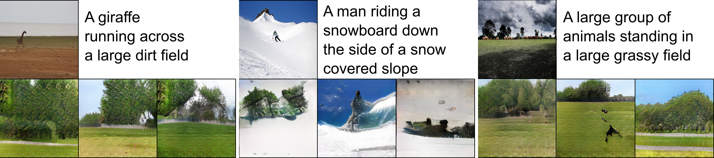
    <figcaption><i>Figure 23: Generated images from the MS-COCO data set when there is no output from the object pathway. While the background is realistic, important objects from the image captions are ignored, as their bounding box is too small and, therefore, the object pathway is not utilized.</i></figcaption>
</figure>

Another issue is the generalization of objects to previously unseen locations. Experiments on the Multi-MNIST data set show that the model in its current form is unable to generalize objects to locations at which it has not seen **any** object during training. When we train the model with images that do not contain any digits in the lower half of the image, the model also fails to generate images that contain digits in the lower half of the image.

<figure>
    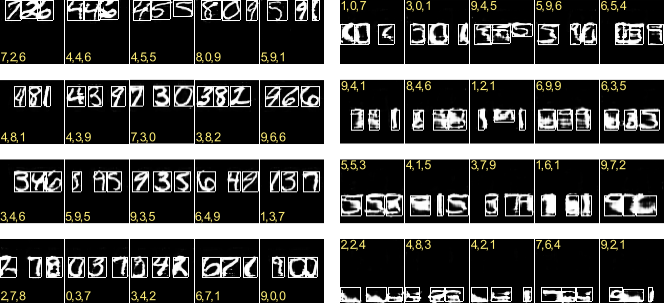
    <figcaption><i>Figure 24: Generated images from the Multi-MNIST data set when the model was trained with images that do not contain any digits in the lower half. Digits in the top half of the image are still recognizable, but digit quality degenerates in the lower half of the image.</i></figcaption>
</figure>

However, our model is able to generalize objects to locations at which it has not observed that specific object before, as long as other (similar) objects have been observed at that location. We trained our model with images that contain only the digits {0,1,2,3,4} in the top half of the image and only digits {5,6,7,8,9} in the bottom half of the image. After training, the model is capable of generating images that contain digits 0-4 also in the bottom half of the image and digits 5-9 in the top half.

<figure>
    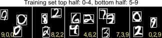
    <figcaption><i>Figure 25: Generated images from the Multi-MNIST data set when the model was trained with images that only contain digits 0-4 in the top half of the image and digits 5-9 in the bottom half. We can see that the model is able to generalize digits to previously unseen locations, e.g. generating a "0" in the bottom half of an image.</i></figcaption>
</figure>

Finally, at the moment our model needs the object categories and the bounding boxes in addition to the image caption to generate images, which somewhat limits the usability for unsupervised image generation. In the future, this limitation could be avoided by extracting the relevant bounding boxes and labels directly from the image caption, as it is done for example by [Hong et al.](https://arxiv.org/abs/1801.05091), [Xu et al.](https://arxiv.org/abs/1807.03877), and [Tan et al](https://arxiv.org/abs/1809.01110).

You can download the models and generate new images for yourself. You can find the code, data sets and pre-trained models on our [Github](https://github.com/tohinz/multiple-objects-gan) page. If you have any more questions or feedback feel free to contact me via <hinz@informatik.uni-hamburg.de>.

---

---

<a name="myfootnote1">1</a>: it also means we can put cat pictures into scientific papers, which is awesome.

<a name="myfootnote2">2</a>: [Reed et al.](https://arxiv.org/abs/1610.02454) propose a similar architecture, but focus only on one individual object within an image. For more details on the differences please see our [paper](https://arxiv.org/abs/1901.00686).

<a name="myfootnote3">3</a>: see [here](https://arxiv.org/abs/1802.03446) for an overview of the pros and cons of different evaluation metrics for GANs

<a name="myfootnote4">4</a>: please refer to Table 1 of our [paper](https://arxiv.org/abs/1901.00686) for more details

<a name="myfootnote5">5</a>: for more details on the exact procedure as well as more detailed results please see the Appendix of our [paper](https://arxiv.org/abs/1901.00686) 
